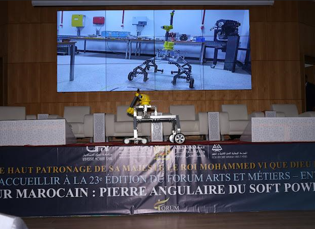

# SIANA | Industrial Robotics Engineering

<p align="center">
  <strong>TGV Inspection Robot</strong><br>
  Mechanical Engineering · Electrical Engineering · Electronics · Embedded Robotics · Interface Engineering · System Integration
</p>

<p align="center">
  
  
  
</p>

<p align="center">
  <strong>Team Contact:</strong> <a href="mailto:a.elhaoudar@edu.umi.ac.ma">a.elhaoudar@edu.umi.ac.ma</a>
</p>

---

## Project Image

<p align="center">
  
</p>

<p align="center">
  <strong>SIANA Industrial Inspection Robot</strong><br>
  Main project platform and engineering integration target
</p>

---

# 01 | PROJECT OVERVIEW

The **TGV Inspection Robot** is an industrial robotic platform developed for automated visual inspection of high-speed train undercarriages at SIANA maintenance facilities.

Our project brings together multiple engineering disciplines, including mechanical design, electrical systems, embedded control, sensing, robotic manipulation, onboard computing, communication, operator interfaces, computer vision, and artificial intelligence.

Through this repository, we document our multidisciplinary engineering work and present the architecture, technologies, interfaces, documentation, and technical evidence associated with the project.

Our objective is to provide a clear technical view of the robot and to show how the different engineering disciplines interact to form one integrated industrial robotic system.

---

# 02 | ENGINEERING SCOPE

We approached the project as an integrated industrial robotic system rather than as a collection of independent subsystems.

```text
                    TGV INSPECTION ROBOT
                            |
        +-------------------+-------------------+
        |                   |                   |
        v                   v                   v
   MECHANICAL          ELECTRICAL          ELECTRONICS
        |                   |                   |
        +-------------------+-------------------+
                            |
                            v
                    EMBEDDED CONTROL
                            |
                            v
                   ONBOARD COMPUTING
                            |
             +--------------+--------------+
             |                             |
             v                             v
       ROBOT CONTROL                 AI / VISION
             |                             |
             +--------------+--------------+
                            |
                            v
                  OPERATOR INTERFACE
                            |
                            v
                  INSPECTION WORKFLOW
```

### Main Engineering Domains

| Domain | Main Content |
|---|---|
| Mechanical | Chassis, wheels, robotic arm, fairing, CAD, drawings |
| Electrical | Power architecture, wiring, protection, actuators |
| Electronics | Controllers, sensors, communication interfaces |
| Embedded | Robot control, telemetry, low-level interfaces |
| Interface | Operator control, visualization, sensor feedback |
| Software | Robot-side and station-side software |
| AI | Detection, inference, and model-training workflow |
| Maintenance | Preventive maintenance and service procedures |
| Integration | Mechanical, electrical, electronic, and software interfaces |

---

# 03 | SYSTEM ARCHITECTURE

Our project is organized around a combination of physical hardware, embedded systems, onboard computing, software, communication, and operator interfaces.

The software platform described in our project is divided into two principal environments.

## Robot-Side System

The robot-side software supports functions such as:

- Autonomous navigation
- Camera operation
- Lighting control
- Onboard AI inference
- Wireless communication
- Battery and system-health monitoring
- Operator commands
- Synchronization of inspection data

## Station-Side Platform

The control station provides functions related to:

- Robot management
- Inspection-session management
- Telemetry visualization
- Video processing and storage
- AI model management
- Defect records
- Inspection reports
- Authentication and access control
- Notifications and alerts
- Audit logging

## Communication Layer

Our project documentation identifies communication technologies including:

```text
MQTT
 |
 +---- Command messaging
 +---- Robot telemetry

WebRTC
 |
 +---- Low-latency video streaming

Object Storage
 |
 +---- Inspection video
 +---- High-resolution images
```

The software context includes technologies such as:

- Python
- FastAPI
- PostgreSQL
- Redis
- MinIO
- MQTT
- WebRTC
- Docker

---

# 04 | MECHANICAL ENGINEERING

Our mechanical work focuses on the physical structure and integration of the inspection robot.

## Mechanical Architecture

The documented robot includes:

- Aluminium-profile chassis
- Driven wheels
- Caster wheels
- Removable protective fairing
- Robotic arm
- Camera support
- Mechanical mounting interfaces
- Maintenance-accessible components

## Mechanical Engineering Activities

Our mechanical documentation is organized around:

```text
mechanical/
|
+-- cad/
|   +-- assemblies/
|   +-- chassis/
|   +-- arm/
|   +-- wheel-system/
|
+-- drawings/
|   +-- definition/
|   +-- assembly/
|   +-- manufacturing/
|
+-- schematics/
|
+-- maintenance/
|
+-- README.md
```

### Mechanical Evidence

Depending on publication and ownership constraints, the mechanical section can contain:

- CAD assemblies
- Part models
- Definition drawings
- Assembly drawings
- STL files
- Mechanical research
- Maintenance documentation

These materials help us document the design choices, interfaces, physical architecture, and integration of the robot.

---

# 05 | ELECTRICAL ENGINEERING

Our electrical engineering work documents how energy, actuators, sensors, controllers, and protection systems are interconnected.

## Main Topics

Our electrical documentation covers areas such as:

- Battery architecture
- Power distribution
- DC/DC conversion
- Motor supply
- Controller supply
- Sensor supply
- Wiring
- Electrical protection
- Emergency-stop architecture
- Actuator interfaces
- Communication wiring

## Electrical Structure

```text
electrical/
|
+-- schematics/
|   +-- power/
|   +-- controllers/
|   +-- sensors/
|   +-- actuators/
|   +-- communication/
|   +-- emergency-stop/
|
+-- wiring/
|
+-- protection/
|
+-- variants/
|
+-- bom/
|
+-- README.md
```

### Configuration Control

Our project material may contain different electrical configurations or design variants.

We keep these variants identifiable rather than silently merging them into a single configuration.

When the available project evidence does not establish a final validated configuration, we preserve the different documented variants and identify them accordingly.

---

# 06 | ELECTRONICS & EMBEDDED ROBOTICS

Our robot combines sensors, controllers, embedded systems, and onboard computing.

The project material identifies technologies including:

```text
Sensors
   |
   v
Microcontrollers
   |
   +---- ESP32
   +---- Arduino Mega
   |
   v
Onboard Computing
   |
   +---- Jetson Nano
   +---- Raspberry Pi 5
   |
   v
Robot Functions
   |
   +---- Control
   +---- Telemetry
   +---- Communication
   +---- Vision / AI
```

Our electronics documentation is organized around:

```text
electronics/
|
+-- architecture/
+-- wiring/
+-- controllers/
+-- sensors/
+-- communication/
+-- component-docs/
+-- README.md
```

The embedded section distinguishes between:

- Verified project source code
- Project architecture
- Representative code
- Reconstructed examples
- Integration work

This distinction helps us maintain a clear boundary between the complete team project and individual examples or supporting material.

---

# 07 | ROBOT CONTROL INTERFACE

We developed and documented an interface layer for robot control and monitoring.

```text
interface/
|
+-- code/
|   +-- RobotArmInterface.pde
|   +-- RobotControlerInterface.pde
|
+-- presentation/
|
+-- protocol/
|
+-- diagrams/
|
+-- README.md
```

## Interface Functions

The supplied Processing interface includes functionality related to:

- Five-joint robot control
- Target-angle commands
- Current-angle feedback
- HOME positioning
- Robotic-arm visualization
- Temperature monitoring
- Humidity monitoring
- Distance measurements
- Sensor-history graphs
- Serial communication
- Connection-status monitoring

### Joint Model

| Joint | Documented Range |
|---|---:|
| Base | -180° to +180° |
| Shoulder | 0° to 180° |
| Elbow | 0° to 180° |
| Pan | 0° to 180° |
| Tilt | 0° to 180° |

The interface protocol uses serial communication at **115200 baud**.

`RobotArmInterface.pde` is based on the supplied Processing interface source.

`RobotControlerInterface.pde` is included as a companion interface/integration component and should be interpreted according to the available project attribution evidence.

---

# 08 | SOFTWARE & AI CONTEXT

Our software platform supports the inspection workflow from robot operation to data management and analysis.

## Robot-Side Software

```text
Navigation
   |
Camera / Lighting
   |
AI Inference
   |
Telemetry
   |
Communication
   |
Inspection Data
```

## Station-Side Software

```text
Robot Management
       |
Inspection Sessions
       |
Video / Image Management
       |
Defect Records
       |
AI Training
       |
Reports / Analytics
```

### Technologies Documented in the Project

| Category | Technologies |
|---|---|
| Backend | Python, FastAPI |
| Database | PostgreSQL |
| Cache | Redis |
| Object Storage | MinIO |
| Messaging | MQTT |
| Video | WebRTC |
| Deployment | Docker |
| AI | Machine-learning / YOLO-based workflow |

This software context shows how our digital systems support the physical robot and the overall inspection workflow.

---

# 09 | MAINTENANCE ENGINEERING

We treat maintenance as an important part of the robot engineering lifecycle.

Our maintenance documentation can be organized as:

```text
maintenance/
|
+-- manuals/
+-- preventive/
+-- inspection-checklists/
+-- maintenance-history/
+-- component-service/
+-- README.md
```

Typical documented maintenance subjects include:

- Chassis and fairing inspection
- Wheel-support inspection
- Wheel-play inspection
- Caster inspection
- Cleaning and corrosion checks
- Emergency-stop checks
- Movement-warning checks
- Robotic-arm fastening
- Sealing inspection
- Periodic general inspection

The maintenance section connects our physical design with long-term industrial operation, serviceability, and preventive maintenance.

---

# 10 | ENGINEERING DOCUMENTATION

Our documentation layer explains the engineering work without unnecessarily duplicating every source file.

## Academic Project Image

The main project image used in this README is stored at:

```text
docs/academic/SIANA_Industrial_Robot.PNG
```

The image is referenced using a repository-relative path so that GitHub can render it directly from the repository.

## Documentation Structure

```text
documentation/
|
+-- system-architecture.md
+-- mechanical-engineering.md
+-- electrical-engineering.md
+-- electronics-engineering.md
+-- embedded-systems.md
+-- interface-engineering.md
+-- system-integration.md
+-- testing-and-validation.md
+-- maintenance-engineering.md
+-- contribution.md
```

Our documentation follows the principle:

```text
DOCUMENTATION
     |
     +---- explains the engineering
     |
     v
ENGINEERING FILES
     |
     +---- support the engineering
```

---

# 11 | ENGINEERING EVIDENCE & ATTRIBUTION

Because this is a multidisciplinary team project, we distinguish between different levels of attribution.

| Status | Meaning |
|---|---|
| Explicitly documented | The project material directly identifies the contribution |
| Project-supported | The contribution is strongly supported by technical evidence |
| Team-level | The work belongs to the project team |
| Inferred | The interpretation is derived from available evidence |
| Other contributor | The source identifies another contributor |
| Uncertain | The available material is insufficient to verify ownership |

## Source Priority

When documenting our project, we follow this priority:

```text
1. Direct project files
2. Technical report
3. Project documentation
4. Team GitHub repository
5. Project images / videos
6. CV for professional context
7. Team explanations and clarifications
8. General engineering knowledge
```

This hierarchy helps us avoid presenting assumptions as confirmed project facts.

---

# 12 | PROJECT VARIANTS

Our project material may contain different technical variants created during the development process.

Examples can include:

- Alternative controller architectures
- Alternative battery configurations
- Alternative motor selections
- Alternative sensor arrangements
- Different software architecture stages

We keep these variants identifiable as documented development states until the available project evidence establishes the final validated configuration.

This allows us to preserve the development history and better understand how the engineering architecture evolved.

---

# 13 | REPOSITORY STRUCTURE

```text
SIANA-Industrial-Robotics-Engineering/
|
+-- mechanical/
|   +-- cad/
|   +-- drawings/
|   +-- schematics/
|   +-- maintenance/
|
+-- electrical/
|   +-- schematics/
|   +-- wiring/
|   +-- protection/
|   +-- variants/
|   +-- bom/
|
+-- electronics/
|   +-- architecture/
|   +-- wiring/
|   +-- controllers/
|   +-- sensors/
|
+-- embedded/
|
+-- interface/
|   +-- code/
|   +-- presentation/
|   +-- protocol/
|   +-- diagrams/
|
+-- electromechanical-integration/
|
+-- integration/
|
+-- maintenance/
|
+-- documentation/
|
+-- software-context/
|
+-- media/
|
+-- contribution/
|
+-- tests/
|
+-- bom/
|
+-- README.md
```

There is intentionally **no separate `calculations/` section** in this repository structure.

---

# 14 | HOW TO REVIEW THIS PROJECT

A technical reviewer can follow the project through the following path:

```text
                    README
                      |
          +-----------+-----------+
          |           |           |
          v           v           v
      MECHANICAL   ELECTRICAL  ELECTRONICS
          |           |           |
          +-----------+-----------+
                      |
                      v
                EMBEDDED SYSTEMS
                      |
                      v
                INTERFACE LAYER
                      |
                      v
              SYSTEM INTEGRATION
                      |
                      v
                MAINTENANCE
```

For detailed verification, each engineering explanation should lead to the corresponding project evidence, such as:

- CAD file
- Technical drawing
- Electrical schematic
- Wiring documentation
- Source code
- Test result
- Maintenance document
- Photograph or video

---

# 15 | ENGINEERING APPROACH

We follow a multidisciplinary engineering workflow:

```text
Requirements
     |
     v
System Architecture
     |
     v
Mechanical / Electrical Design
     |
     v
Electronics & Embedded Control
     |
     v
Software / Interface
     |
     v
System Integration
     |
     v
Testing & Validation
     |
     v
Maintenance
```

Our objective is to demonstrate how the different engineering disciplines interact to create a functional industrial robotic inspection system.

We consider the robot as one complete engineering system in which mechanical, electrical, electronic, embedded, software, interface, and maintenance aspects must work together.

---

# 16 | TEAM PROJECT POSITIONING

This repository represents our multidisciplinary work on an industrial robotics project.

Our work covers and connects:

- Mechanical design
- CAD and technical drawings
- Electrical architecture
- Electronics
- Embedded systems
- Robotic-arm integration
- Sensor integration
- Operator interfaces
- System integration
- Maintenance engineering
- Technical documentation
- Software and AI context

The emphasis of this repository is on the **complete engineering system** and on how the physical, electrical, and digital components of the robot operate together.

## Contact

For project-related information:

**Email:** [a.elhaoudar@edu.umi.ac.ma](mailto:a.elhaoudar@edu.umi.ac.ma)

---

# 17 | COPYRIGHT, OWNERSHIP & PUBLICATION

This repository documents a **team engineering project**.

It should not imply individual ownership of every project artifact.

Before public publication, we should verify:

- Whether project documents may be redistributed
- Teammate-owned source code
- Institutional documentation
- CAD and manufacturer documents
- Confidential information
- Required original attribution

Where authorship is uncertain, we preserve that uncertainty rather than assigning unsupported ownership.

The purpose of this repository is to provide an organized technical representation of our engineering project while respecting the ownership and attribution of the different contributors and project sources.

---

<p align="center">
  <strong>SIANA — Industrial Robotics Engineering</strong><br>
  TGV Inspection Robot
</p>

<p align="center">
  Mechanical · Electrical · Electronics · Embedded · Interface · Integration · Maintenance
</p>

<p align="center">
  <strong>Team Contact:</strong> <a href="mailto:a.elhaoudar@edu.umi.ac.ma">a.elhaoudar@edu.umi.ac.ma</a>
</p>
